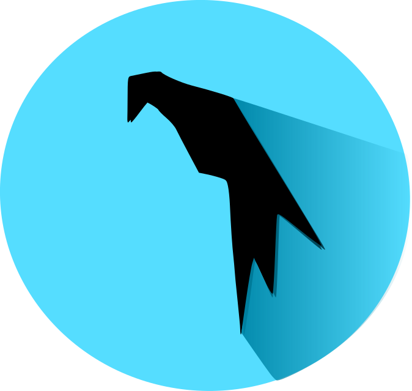

# My introduction
- First Name : █████
- Name : ███████
- Age : ██
- Adresse : ████████████████████████

****

## About me
Student in : **Cyber-security**, **IT**, **Development** & **Electronics**.
- **Senior Analyst** (**Confirmed Analyst**) at [Protect](https://www.protect-bot.fr/).
- **Administrator** & **Partnership manager** at [Sky](https://skybot.fr/).

## My skills

### The tools I use

 &nbsp;

 &nbsp;

 &nbsp;

 &nbsp;

 &nbsp;

 &nbsp;

 &nbsp;

 &nbsp;

 &nbsp;

 &nbsp;

### The librarys I use

 &nbsp;

 &nbsp;

### The languages I use
###### Where I am an intermediary

 &nbsp;
 
 &nbsp;

 &nbsp;

###### Where I begin
 
 &nbsp; 

 &nbsp; 

****

 ###### Inspired by the profile of  [Str4ky](https://github.com/Str4ky)

